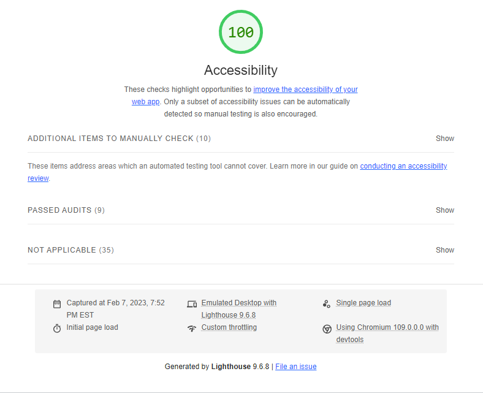
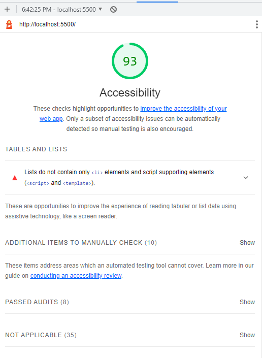
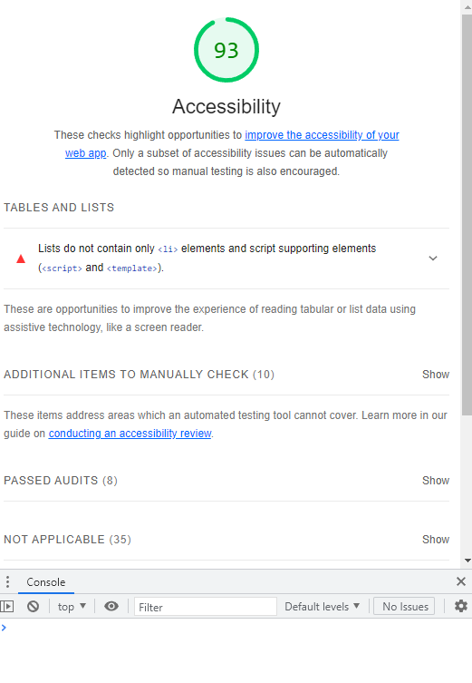

# Code201-Week1
Week 1 Labs

# LAB - 02

## About Me

#### Description
 
Initial learning and implementation of creating and calling `index.html`, `app.jss`, `styles.css` files correctly and committing to GitHub.

#### Author: Nicholas Brown

#### Links and Resources

#### Any Links you used as reference

#### Lighthouse Accessibility Report Score

### LightHouse Lab02

### LightHouse Lab03

### LightHouse Lab05

#### Provide a screenshot of your score after running a Lighthouse Accessibility report.

#### Reflections and Comments